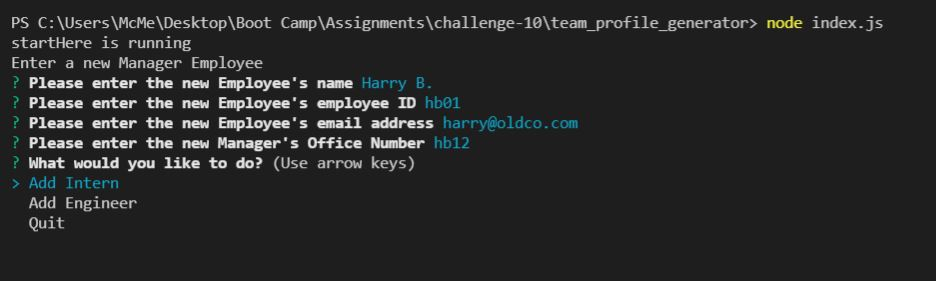
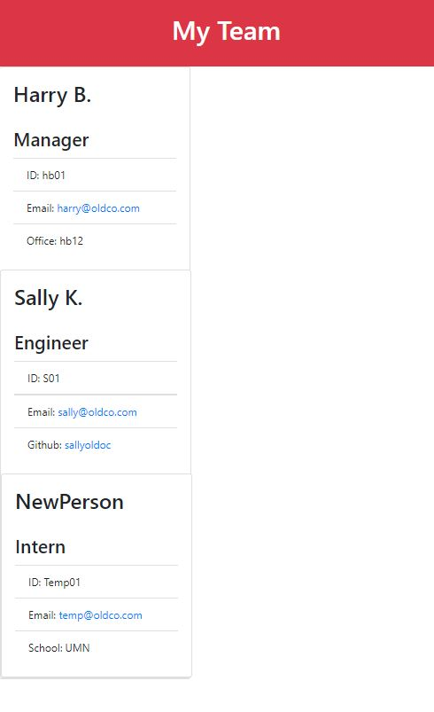

# team_profile_generator
U of MN Coding Bootcamp - Fall 2021 Module 10 - Challenge 10

## Overview

The Team Profile Generator is a command prompt application that generates an HTML file containing a team profile.  The team profile contains:  

1. Managers
2. Engineers
3. Interns

Each role contains the employee's name, ID and email address and a unique value to the role.   Managers have an associated Office Number, Engineers a linked Github repository and Interns an associated School.

The user will first enter the manager and associated office number.  Following the entry of the manager the user may choose to add any number of interns or engineers to the team.  The only requirements is that there must be atleast 1 manager.

After all the team members have been added, the users selects quit and the file will be generated in the /dist folder as myteam.html.

## Demo

## Installation

To install the Team Profile Generator you will need the following:

1. The application
2. [Node.js](https://nodejs.org/en/download/ "Install Node.js")
3. Any web browser to view the HTML File
4. A command prompt tool to run the application

## Technical Design

The Team Profile Generator uses an object oriented architecture with a base class of Employee that is extended to the Manager, Engineer and Intern classes.  The basic function of these classes is tested by Jest unit tests found in the __tests__ folder.  

The application prompts the user for input using NPM Inquirer and uses that input to generate an HTML file that is saved using FS.

## Uses

*HTML
*CSS
*Java Script
*Node.JS
*NPM FS
*NPM Inquirer
*Bootstrap
*Jest

## Credits
Written by GitAndrewCoffee for the University of MN Coding Boot Camp, Dec 2021.